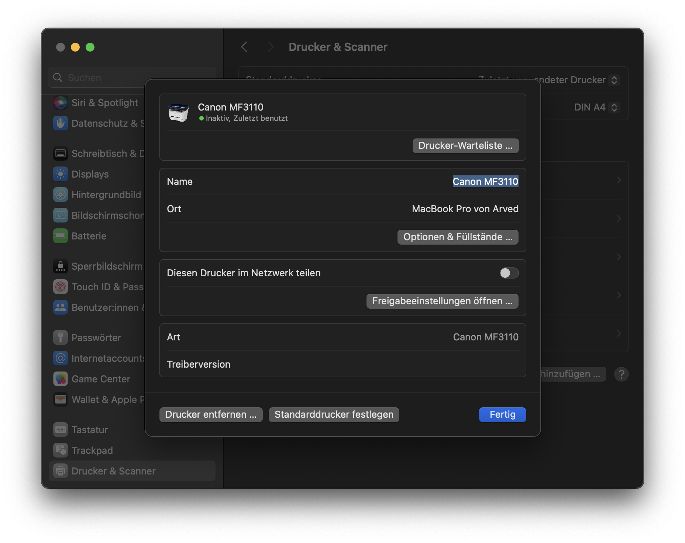

macOS (Mac OS X) CUPS driver for Canon CARPS printers
====================================

This provides rastertocups filter and PPD files (specified by carps.drv file) which
allows these printers to print from macOS. 

carps-decode is a debug tool - it decodes CARPS data (created either by rastertocups
filter or windows drivers), producing a PBM bitmap and debug output.

This driver has been tested and compiled on macOS 14.7 on an Apple Silicon machine.
If compiled from source it should work on any software version and any architecture (arm/x86).

Printers known to use CARPS data format:

Printer type (IEEE1284 ID)	| Status on macOS
--------------------------------|--------------------------------------------------------
MF5730				| untested
MF5750				| untested
MF5770				| untested
MF5630				| untested
MF5650				| untested
MF3110				| works ✅
imageCLASS D300			| untested
LASERCLASS 500			| untested
FP-L170/MF350/L380/L398		| untested
LC310/L390/L408S		| untested
PC-D300/FAX-L400/ICD300		| untested
L180/L380S/L398S		| untested
L120				| not supported - different data format
MF3200 Series			| not supported - different data format, different header
MF8100 Series			| not supported - different data format, color

Compiling from source
---------------------
Requirements: make, gcc (Xcode Commandline Tools)

To compile, simply run "make":

    $ make

To install the compiled driver, run:

    $ sudo make install

You can then install the printer using System Preferences.

