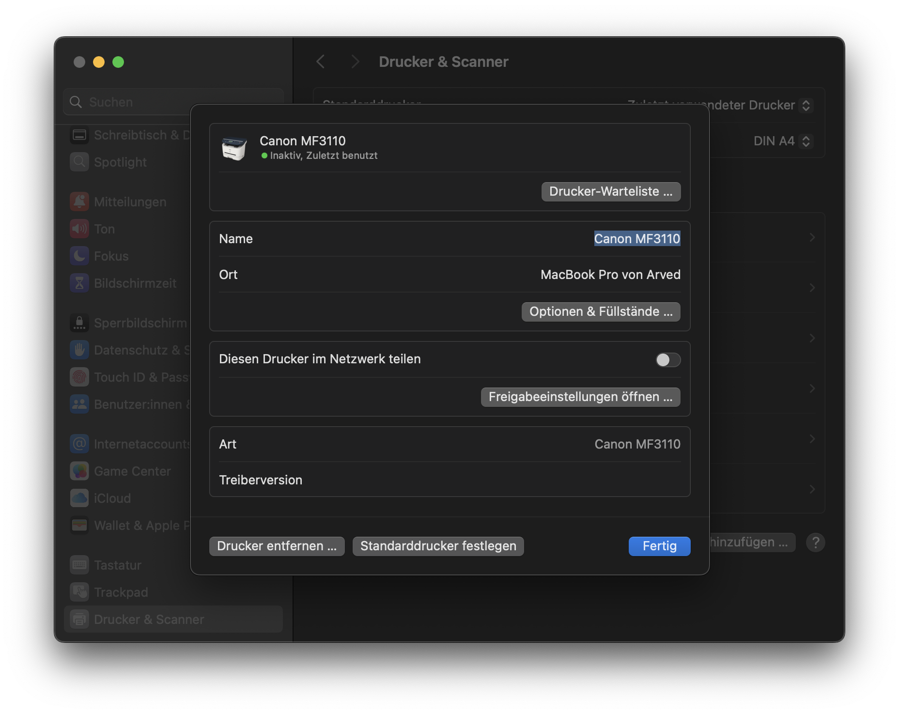

macOS (Mac OS X) CUPS driver for Canon CARPS printers
====================================

This provides rastertocups filter and PPD files (specified by carps.drv file) which
allows these printers to print from macOS. 

carps-decode is a debug tool - it decodes CARPS data (created either by rastertocups
filter or windows drivers), producing a PBM bitmap (or raw G4 data) and debug output.

This driver has been tested and compiled on macOS 14.7 on an Apple Silicon machine.
If compiled from source it should work on any software version and any architecture (arm/x86).

Printers known to use CARPS data format:

Printer type (IEEE1284 ID)	| Status on macOS
--------------------------------|--------------------------------------------------------
MF5730				| untested
MF5750				| untested
MF5770				| untested
MF5630				| untested
MF5650				| untested
MF3110				| works ✅
imageCLASS D300			| untested
LASERCLASS 500			| untested
FP-L170/MF350/L380/L398		| untested
LC310/L390/L408S		| untested
PC-D300/FAX-L400/ICD300		| untested
L180/L380S/L398S		| untested
L120				| untested
MF3200 Series			| untested
MF8100 Series			| not supported - different data format, color

Compiling from source
---------------------
Requirements: gcc (Xcode Commandline Tools), HomeBrew

To install the dependencies:

    $ brew install jpeg libtiff zstd xz

To compile, simply run "make":

    $ make

To install the compiled driver, run:

    $ sudo make install

You can then install the printer using System Preferences.

Paper size problems
-------------------
CARPS printers are very sensitive to paper size.

If only one page prints and the printer LCD shows "check paper size" or no pages are printed until you power cycle the printer, make sure the paper size you have set in the driver/document/application matches the size set on printer panel (LCD menus).

~~In some cases it's recommended to set scaling to 95%.~~ -> fixed with macOS specific ppd patches (caused by a bug in ppdc)